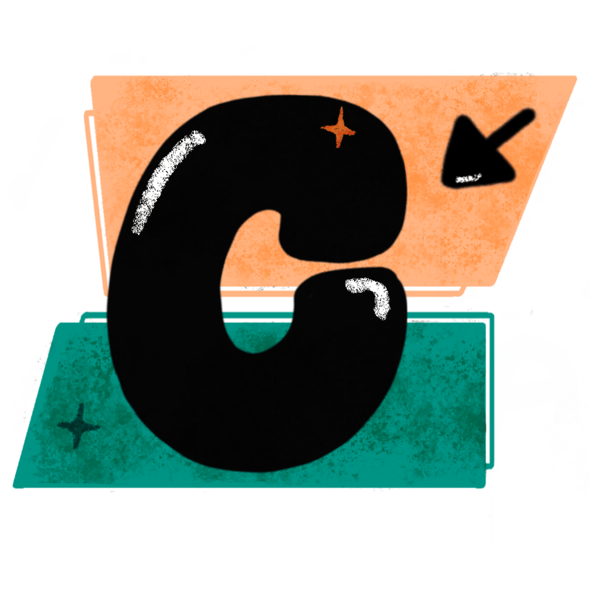

  <h1> Code Campus </h1>
  
  <h2>Dive into the world of Python! 🌍</h2>

## Visit Us

> [!NOTE]
> We offer multiple *free* courses on our Code Campus page [here](https://code-campus.at/)!

##  Courses

All courses are constantly updated and improved! We offer course material for 
beginners and more advanced programmers alike. 🚀

| Course                           | Link                                                          |
|----------------------------------|---------------------------------------------------------------|
| 🐍 **Python Crash Course**       | [Start Learning](https://code-campus.at/python/)           |
| 🐍🐍 **Python Extensive Course** | [Start Learning](https://code-campus.at/python-extensive/) |
| 📊 **Statistics**                | [Start Learning](https://code-campus.at/statistics/)       |
| 🤖 **Data Science**              | [Start Learning](https://code-campus.at/data-science/)     |
| 👁️ **Computer Vision**          | [Start Learning](https://code-campus.at/yolo/)             |
| 🔬 **MicroPython**               | [Start Learning](https://code-campus.at/micropython/)      |
